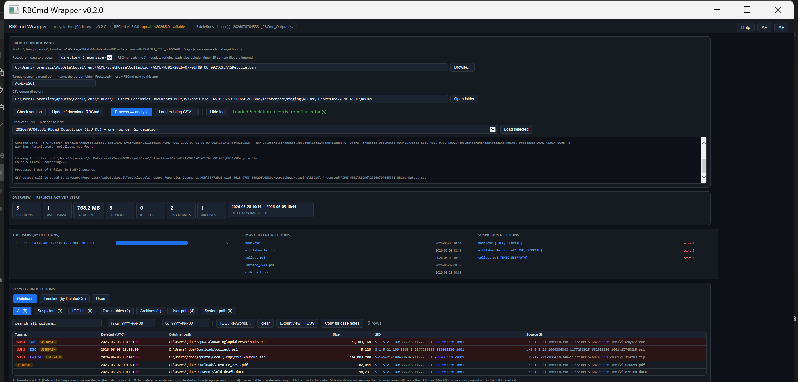

# RBCmd-Wrapper

A single-file GUI for **Recycle Bin triage** with Eric Zimmerman's [RBCmd](https://github.com/EricZimmerman/RBCmd) — runs RBCmd for you and turns the output into an interactive, suspicion-scored view that answers *"what was deleted, when, and by which account."* One `.hta`, no install, part of the [DFIR-Artifact-Finder](https://github.com/bpmorris22/DFIR-Artifact-Finder) wrapper family.

When a file goes to the Recycle Bin, Windows writes a metadata file — `$I……` (Vista and later) or `INFO2` (XP) — recording the item's **original full path**, its **size**, and the **deletion timestamp**. RBCmd parses those; this wrapper scores and pivots them. A surviving `$I` proves a deletion even when the matching `$R` content file is gone.



> Deletions view over a synthetic bin: a deleted `node.exe` from AppData, an `exfil-bundle.zip` from Temp and a
> `collect.ps1` all score 3 and shade; per-SID rollup and deletion timeline available as tabs. Screenshot uses
> synthetic data (fake host `ACME-WS01` / user `jdoe`) — no real case data.

## Quick start

1. Put `RBCmd-Wrapper.hta` anywhere and double-click it — use **Update / download RBCmd** to fetch the engine, or point it at an existing copy (KAPE `Modules\bin` is found automatically). RBCmd is near-instant.
2. Point the input at a collected `$Recycle.Bin`, a single per-user (`S-1-5-21-…`) bin folder, a single `$I` file, or a whole collection tree / host root — directory mode recurses and finds every `$I` (and legacy `INFO2`) below (KAPE / Velociraptor trees work as-is).
3. Confirm the **Target hostname** guess, then **Process → analyze**. Or **Load existing CSV…** to view an RBCmd CSV you already have.

## Views & scoring

- **Deletions** (default) — one row per deleted item, score-ranked; **Timeline** — the same rows by deletion time; **Users** — grouped per **SID** (per-user bin): deletion count, total bytes, newest deletion, max score. Sortable, filterable, resizable columns, a per-record detail pane, and CSV export.
- Suspicion scoring (threshold ≥ 3): **IOC / keyword hit** (+3, on original path / name / SID / source), **deleted executable or script** (+2: `exe dll sys ps1 bat cmd vbs js jse wsf hta scr msi jar`), **deleted archive** (+2 — a *staging-cleanup* signal: an exfil bundle deleted after upload: `zip rar 7z cab tar gz tgz`), **user-writable / suspicious origin** (+1: `\AppData\ \Temp\ \Users\Public\ \Downloads\ \PerfLogs\ \ProgramData\` non-vendor), **system-dir origin** (+1: `\Windows\` or `\Program Files` — unusual to delete from a system directory).

## Command line

```
mshta "RBCmd-Wrapper.hta" "<inputOrCsv>" ["<outDir>"] [/auto] [/from:yyyy-MM-dd] [/to:yyyy-MM-dd]
```

- `<input>` — a `.csv` (auto-loads into the viewer), a `$I` file, or a directory (prefilled; processed with `/auto`).
- `<outDir>` — CSV output directory (optional; defaults to `_Processed\<host>\RBCmd` next to the app).
- **Target hostname** is required before processing — it names the `_Processed\<host>\RBCmd` output folder next to the app (family convention shared with the DFIR-Artifact-Finder, so processed evidence is visible per host per tool). Guessed from `Collection-<host>-…` paths or a passed `_Processed\<host>\` outDir — overwrite the guess if it's wrong.
- **Shared IOC list** — an `IOC.txt` next to the app (one term per line, `#` comments) is auto-merged into the IOC box at launch; one list covers the whole toolkit and terms you paste locally are kept.
- **Run provenance + triage summary** — every successful run appends a `runinfo.json` entry (app, host, input path, files) in the output folder, including a triage summary (entries, flagged count, max score, top hits); the DFIR-Artifact-Finder shows these per host in its inventory, even for standalone runs.
- `/from:yyyy-MM-dd` `/to:yyyy-MM-dd` — case window (UTC, inclusive): prefills the date filter and is recorded in `runinfo.json`; never affects scoring. The [DFIR-Artifact-Finder](https://github.com/bpmorris22/DFIR-Artifact-Finder) passes these on every launch.

## Notes

- **SIDs are shown raw.** Resolving a `S-1-5-21-…` SID to a username needs the SAM / SOFTWARE hive and is out of scope here — map it offline if you need the account name.
- An **emptied** Recycle Bin leaves no `$I` at all — there is nothing for RBCmd to parse. Go to `$UsnJrnl` for evidence of those deletions.
- All timestamps are UTC (`DeletedOn`). RBCmd reads the `$I` metadata only; `$R` content files are ignored.
- Columns are resizable — drag a header's right edge; double-click the edge to reset. Widths are remembered per view.
- Requires Windows (mshta / IE-JScript host).

MIT © 2026 Ben Morris
